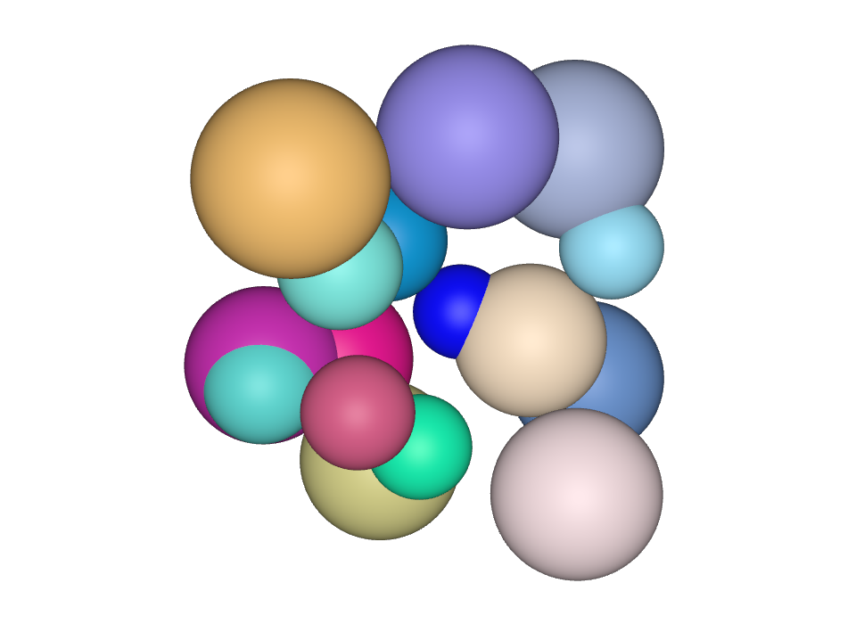

#SketchPad

CLI and Library for generating 3D asset files with a SwiftUI-like DSL.

The focus is .usda files, but also can generate X3D files. 

## Example Usage


### Running a script

```
cd $PROJECT_DIR
swift run sketchpad multiball -s
```

Will run the multiball script, creating a usd file and and x3d file with default names in the directory. 

Not specifying multiball means whatever sketch I currently left as the default sketch will run. Will likely be the contents of ScratchPad. 




### Writing a Sketch

Here is an example Sketch. Currently there is no Protocol, but so far the convention is that there must be a function called `buildStage()` that returns a `Layer`. 

```swift
public struct RandomShell {
    public init(count:Int, radius:Double, ratio:Double = 0.1) {
        self.count = count
        self.radius = radius
        self.ratio = ratio
    }
    let count:Int
    let radius:Double
    let ratio:Double

    let tau = Double.pi * 2
    let π = Double.pi

    public func buildStage() -> some Layer {
        let sun_color = 0.9
        let sphere_radius = radius*ratio
        return Stage {
            Sphere(radius: sphere_radius).color(red: sun_color, green: sun_color, blue: sun_color)
             for _ in 0..<count {
                 let theta = Double.random(in: 0...π)
                 let phi = Double.random(in: 0...tau)
                 let x = radius * sin(theta) * cos(phi)
                 let y = radius * sin(theta) * sin(phi)
                 let z = radius * cos(theta)
                 
                 Sphere(radius: sphere_radius)
                 .color(
                    red: cos(phi).magnitude,
                    green: cos(theta).magnitude, 
                    blue: sin(phi).magnitude
                 )
                 .translateBy(Vector(x: x, y: y, z: z))
             }
        }
    }
}
```

### Adding sketch to a command

The sketches can be rendered out to file like so: 

```swift
let layerStage = RandomShell().buildStage()

let usdabuilder = USDAFileBuilder()
let path_usd = "shell_\(FileIO.timeStamp()).usd"
FileIO.writeToFile(string:usdabuilder.generateStringForStage(stage:layerStage), filePath: path_usd)

let x3dbuilder = X3DFileBuilder()
let path_x3d = "shell_\(FileIO.timeStamp()).x3d"
FileIO.writeToFile(string:x3dbuilder.generateStringForStage(stage:layerStage), filePath: path_x3d)
```

There is a template parsable command to make extending the CLI easier: [template.swift](/Sources/SketchPadCLI/template.swift)


## Upcoming Roadmap
- [x] rewrite to allow for multiple primitive types
- [x] update tests to reflect refactor
- [x] add cube type
- [] add additional tests
- [] add optional "[USDServiceProvider](https://github.com/carlynorama/USDServiceProvider)" to check files / make crates for importing into other Swift projects.  
- [] fix adding colors / materials (X3D has color function not currently using)
- [] add additional primitives
- [] make an "Assembly" or other group type
- [] make an "over" 
- [] add meshes
- [] add camera
- [] add animation


